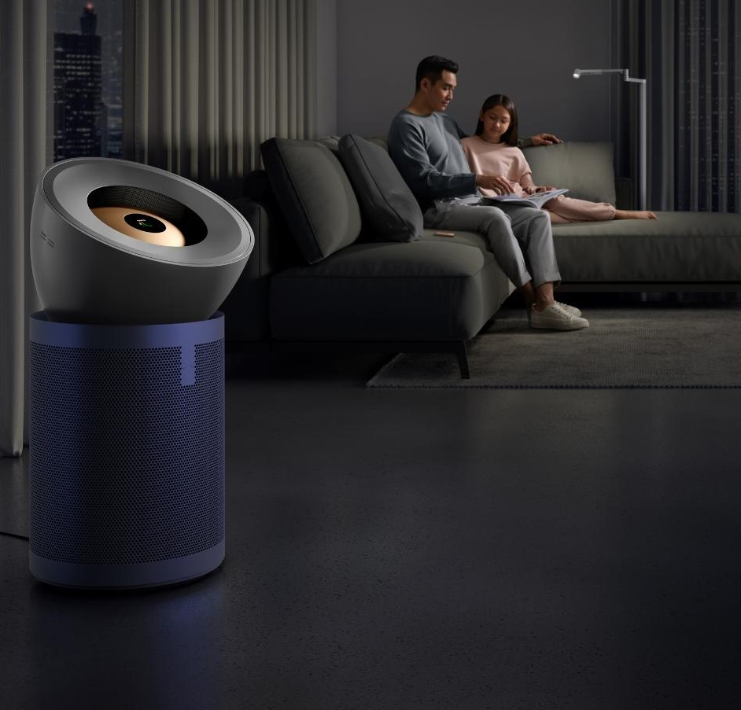
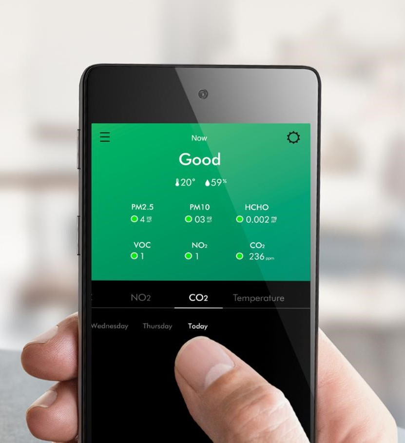

# CSCP

Projet de Conception de Systèmes Cyber Physiques : Sami Joudet, Yasmine Bouakroucha, Moenes Zribi, Robin Georgi

## Idee

Système autonome de contrôle de la qualité de l'air à l'aide capteurs de pollution et de présences ainsi qu'un purificateur d'air.

## Titre temporaire du service ambiant

Système de contrôle de la qualité de l'air

## Type d'environnement

Domicile de l'utilisateur

## Domaine

Confort, Santé.

## Motivation

## Legislation

La législation française concernant le contrôle de la qualité de l'air dans les habitations privées comprend plusieurs éléments importants, notamment :

1. **Loi du 12 Juillet 2010 :** La loi portant engagement national pour l'environnement, promulguée en 2010, a établi l'obligation de surveiller périodiquement la qualité de l'air intérieur dans certains établissements recevant du public (ERP) et les écoles maternelles et élémentaires (Article R221-22 du Code de l'environnement) [[1](https://sante.gouv.fr/sante-et-environnement/batiments/article/surveillance-de-la-qualite-de-l-air-interieur-dans-les-etablissements-recevant)]. Cela concerne principalement les établissements recevant un grand nombre de personnes.

2. **Décret n° 2022-1689 :** En décembre 2022, le gouvernement français a publié le décret n° 2022-1689 modifiant le code de l'environnement en matière de surveillance de la qualité de l'air intérieur. Ce décret précise les modalités de cette surveillance [[2](https://www.legifrance.gouv.fr/jorf/id/JORFTEXT000046829320)].

3. **Radon :** En plus de la surveillance générale de la qualité de l'air, il existe également une réglementation spécifique pour le radon, un gaz radioactif naturel. Cette réglementation implique notamment l'obligation de mentionner le niveau de risque lié au radon lors de l'achat de biens immobiliers [[3](https://www.atmo-bfc.org/air/reglementation-air-interieur)].

Il est important de noter que la surveillance de la qualité de l'air intérieur dans les habitations privées peut varier en fonction de la taille de l'établissement et de la nature de l'activité qui s'y déroule. Les propriétaires et gestionnaires d'ERP et d'écoles doivent se conformer à ces réglementations pour garantir la sécurité sanitaire de leurs occupants.

### 🌐 Sources

1. [sante.gouv.fr - Surveillance de la qualité de l'air intérieur dans les établissements recevant](https://sante.gouv.fr/sante-et-environnement/batiments/article/surveillance-de-la-qualite-de-l-air-interieur-dans-les-etablissements-recevant)
2. [legifrance.gouv.fr - Décret n° 2022-1689 du 27 décembre 2022 modifiant le code de l'environnement](https://www.legifrance.gouv.fr/jorf/id/JORFTEXT000046829320)
3. [atmo-bfc.org - Réglementation air intérieur](https://www.atmo-bfc.org/air/reglementation-air-interieur)

## Attente sociétale

Les attentes sociétales concernant les dispositifs de contrôle de la qualité de l'air dans les habitations privées sont les suivantes :

1. **Santé et bien-être**: La société attend que ces dispositifs garantissent un air intérieur sain et sûr pour les occupants des habitations privées. Cela inclut la réduction des polluants intérieurs pour prévenir les problèmes de santé liés à la qualité de l'air, tels que l'asthme ou les insuffisances respiratoires [[3](https://sante.gouv.fr/IMG/pdf/Plan_Qualite_de_l_air_interieur_octobre_2013.pdf)].

2. **Réduction des polluants**: Les attentes sociétales incluent également la réduction des substances nocives émises à l'intérieur des habitations privées. Cela peut être réalisé grâce à des dispositifs de ventilation et de contrôle de la qualité de l'air intérieur [[2](https://sante.gouv.fr/sante-et-environnement/batiments/article/qualite-de-l-air-interieur)].

3. **Accessibilité et coûts abordables**: La société souhaite des dispositifs d'évaluation de la qualité de l'air intérieur à faibles coûts pour rendre ces technologies accessibles à un plus grand nombre de personnes [[5](http://www.cstb.fr/assets/medias/primequal-recueil-des-resumes-des-travaux-de-recherche-fr-060217.pdf)].

4. **Innovation technologique**: Les attentes comprennent également la recherche et l'adoption de technologies innovantes telles que les micro-capteurs pour le suivi en temps réel de la qualité de l'air intérieur [[6](https://www.anses.fr/fr/system/files/AIR2018SA0271Ra.pdf)].

### 🌐 Sources

1. [ecologie.gouv.fr - Qualité de l'air intérieur](https://www.ecologie.gouv.fr/qualite-lair-interieur)
2. [sante.gouv.fr - Qualité de l'air intérieur - Ministère de la Santé et ...](https://sante.gouv.fr/sante-et-environnement/batiments/article/qualite-de-l-air-interieur)
3. [sante.gouv.fr - Plan d'actions sur la Qualité de l'Air Intérieur](https://sante.gouv.fr/IMG/pdf/Plan_Qualite_de_l_air_interieur_octobre_2013.pdf)
4. [cerema.fr - Qualité de l'air intérieur dans les établissements recevant ...](http://www.cerema.fr/fr/actualites/qualite-air-interieur-etablissements-recevant-du-public)
5. [cstb.fr - QUALITÉ DE L'AIR INTÉRIEUR](http://www.cstb.fr/assets/medias/primequal-recueil-des-resumes-des-travaux-de-recherche-fr-060217.pdf)
6. [anses.fr - Utilisation de micro-capteurs pour le suivi de la qualité de l'air ...](https://www.anses.fr/fr/system/files/AIR2018SA0271Ra.pdf)

## Analyse de l'existant / State of the art

### Purificateurs d'air connectés

Il existe de nombreux purificateurs d'air connectés sur le marché dont les fonctionnalités varient en fonction de leur prix de vente.

1. [Purificateur d'air dyson](https://www.dyson.fr/traitement-de-l-air/purificateurs-ventilateurs/purifier-big-quiet-formaldehyde-bp03) : Ce purificateur dispose de fonctionnalités de mesure de la qualité de l'air ambiant accessibles via une application mobile.
   

2. [Purificateur d'air Philps](https://www.philips.fr/c-p/AC1715_11/purificateur-dair-serie-1000i-pour-pieces-moyennes) : Ce purificateur dispose de fonctionnalités aux modèles proposés par Dyson pour un prix plus accessible.

### Capteurs de pollution

Il existe également de nombreux capteurs de pollution sur le marché. Ces capteurs sont généralement utilisés pour mesurer la qualité de l'air extérieur, mais peuvent également être utilisés pour mesurer la qualité de l'air intérieur.

1. [Capteur de pollution NetAtmo](https://www.netatmo.com/fr-fr/aircare/homecoach) : Ce capteur permet de mesurer la qualité de l'air intérieur et d'obtenir des recommandations pour améliorer la qualité de l'air ambiant.

2. [Capteur de pollution Awair](https://www.getawair.com/products/awair-2nd-edition)

## Innovation et/ou progrès scientifique

L'innovation et le progrès scientifique de cette idée résident dans l'utilisation de capteurs de présence et de détection d'ouverture de denâtres pour effectuer des économies d'énergies en ne sollicitant pas en permanence le purificateur d'air. **En intégrant cette technologie, il devient possible de limiter le temps d'attente des utilisateurs de bus en fournissant des informations en temps réel sur le nombre de places disponibles dans le bus qu'ils souhaitent emprunter. Cette approche révolutionnaire permet une meilleure organisation des déplacements en optimisant l'utilisation des ressources de transport public, ce qui contribue à réduire les congestions, à améliorer l'expérience des passagers et à réduire les émissions de gaz à effet de serre. Cette innovation s'inscrit dans le cadre d'une avancée significative dans la gestion intelligente des transports en utilisant des technologies de pointe pour améliorer la mobilité urbaine et la qualité de vie des citoyens.**

# Quelques élement techniques

Capteurs :

- Pollution de l'air
- Présence
- Ouverture des fenêtres

Actionneurs :

- Purificateur d'air
- humidificateur
- déshumidificateur
